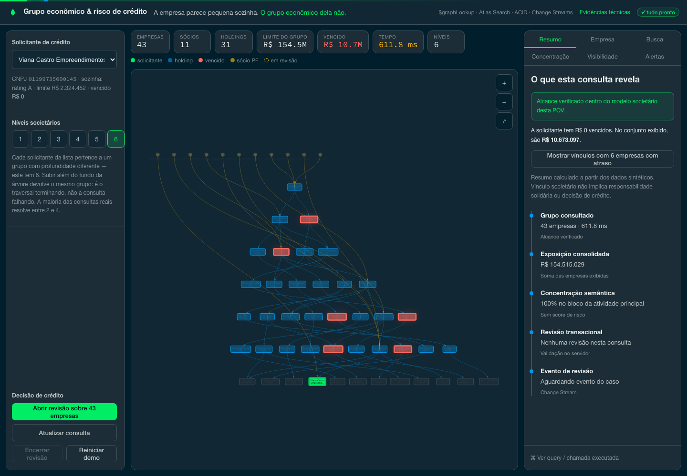
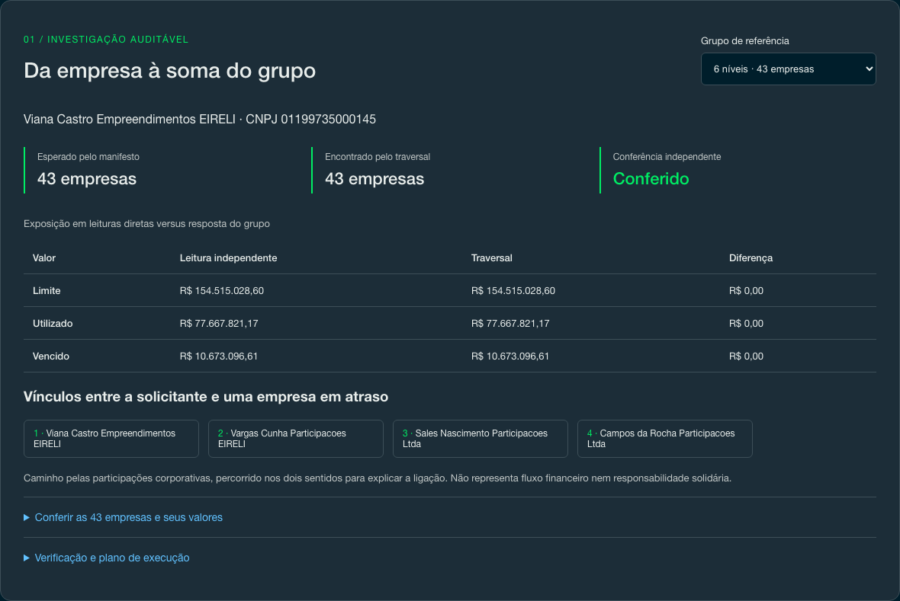
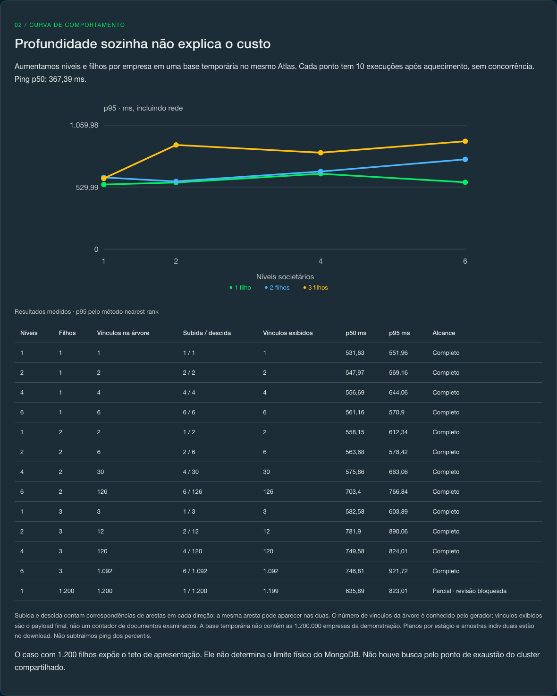

# Graph analytics on MongoDB Atlas — economic groups and visibility hierarchies

A credit applicant has no overdue balance. Its economic group tells a different story: 43 companies, R$ 154.5 million in limits and R$ 10.7 million overdue elsewhere in the ownership chain.

This POV connects those records inside MongoDB. One aggregation walks up to corporate controllers, identifies valid roots, walks down through their holdings and joins credit exposure. A second scenario derives an advisor or manager's commercial scope from a reporting hierarchy.

The dataset is synthetic: 1.2 million companies and about 2.5 million ownership edges. The interface is in Brazilian Portuguese. No customer data is included.

## What the evidence supports

The workload is a bounded ownership investigation entered by a business key. It demonstrates that these traversals, exposure reads, transactional reviews and notifications can share one operational database. It does not establish that MongoDB outperforms a dedicated graph engine or a relational recursive query.

Two relationship models are used deliberately:

| Scenario | Model | Question |
|---|---|---|
| Ownership | `ownership` edge collection, with percentage and role | Which companies belong to this ownership group? |
| Commercial hierarchy | `advisors.reports_to` | Which accounts fall within this profile's reporting chain? |

Dense exploratory networks, unrestricted shortest paths and continuous graph algorithms require a separate evaluation. See [limitations](LIMITATIONS.md).

## Follow an investigation

Select a company and increase the ownership depth. The summary connects the applicant's individual exposure to the group and highlights paths to companies in arrears. A partial result is labelled and cannot open a group review.



Opening a review revalidates the investigation in a transaction and records the group and exposure on the server. Replaying the same valid proof returns the same open case; another investigation overlapping an open case receives a conflict. Closing a review is also idempotent. Change Streams feed the corresponding alerts.

The name search is scoped to the displayed graph unless the presenter explicitly opens the search to the whole database. The visibility selector demonstrates hierarchy reachability, not authentication. Semantic concentration is an optional panel comparing activities with the one carrying the largest individual exposure; it does not count every distinct business.

## Check the result, then inspect the limit

Open **Evidências técnicas** in the header, or visit `/evidence`.

The first section compares six showcase groups against their original generator manifests. Membership, internal corporate edges and credit totals are verified independently of the traversal. The page includes per-company amounts, a path to a distressed company, source hashes and server execution statistics.



The second section varies depth and branching in a temporary Atlas database. It reports raw samples, p50, p95, edge matches in each direction, returned edges and completeness. A 1,200-child case exposes the response cap. These small controlled fixtures are separate from the 1.2-million-company dataset; their results are not a capacity forecast.



The measurements are a dated snapshot, available as [JSON](frontend/public/evidence/results.json). Run them again with:

```bash
backend/venv/bin/python queries/build_evidence.py --runs 10
npm --prefix frontend run build
```

The script reads the demo dataset and creates an isolated `graph_evidence_test_<uuid>` database for the curve, then removes it. Ten warm samples per point provide an exploratory curve, not a stable production tail-latency estimate.

A PostgreSQL comparison is deferred until an equivalent environment is available. The [comparison protocol](docs/comparison-protocol.md) defines the shared contract and measurement conditions. There is no measured winner.

## What it takes to run

- A MongoDB Atlas cluster configured with the Search and Vector Search indexes
  used here. A plain local mongod without the required search services leaves
  those panels unavailable; this repository does not provision local Search.
- Python 3.11 or newer, and Node 18 or newer.
- A Voyage API key for the embeddings. Without it, only the semantic panel is
  unavailable.

## Installation

```bash
cp .env.example .env      # fill in MONGODB_URI and VOYAGE_API_KEY

python3 -m venv .venv && .venv/bin/pip install -r data-generator/requirements.txt
python3 -m venv backend/venv && backend/venv/bin/pip install -r backend/requirements.txt
(cd frontend && npm install)
```

## Generating the data

```bash
bash data-generator/run_all.sh              # people, ownership, hierarchy, indexes
.venv/bin/python schema/search_indexes.py   # search indexes, waits until READY
.venv/bin/python data-generator/embed_activities.py
```

The defaults are 800,000 individuals, 1.2 million companies, 40,000 economic groups
and a 969-person commercial hierarchy. For a quick pass, use
`COMPANIES=200000 bash data-generator/run_all.sh`.

Running it again duplicates nothing: every document has an identifier derived from
its own content, so a second run rewrites the same records.

The population of individuals is a modelling decision, not a volume one. With
1.2 million companies and about 2.2 shareholders each, a population of 150,000 puts
the same person in ~17 companies — "shared shareholder" stops being an exception and
becomes a property of every pair of companies in the base.

## Running

```bash
./start.sh               # UI on 5350, API on 8350
DEV=1 ./start.sh     # with hot reload, for development
```

## Measurements and resilience

Current validation and load results are described in [the validation report](docs/resilience-validation.md). The older latency and ingestion measurements remain in [queries/benchmarks.md](queries/benchmarks.md), labelled with their original environment and date. They do not describe the latency of the current network path or prove a before/after gain for this release.

```bash
backend/venv/bin/python -m unittest discover -s tests -p 'test_*.py'
node --test frontend/tests/*.test.mjs
backend/venv/bin/python tests/test_resilience.py --quick
backend/venv/bin/python tests/live_hardening.py
backend/venv/bin/python tests/stress.py --max 64 --seconds 20
```

The live write suite creates and removes its own database. It does not reset the demonstration dataset. Browser tests cover the usual flow, narrow screens, delayed responses, duplicate clicks, unavailable panels and recovery after disconnection.

Analytical queries have bounded concurrency and may return 429 under saturation. Timings that include these refusals are identified in the report. The tests establish the cases exercised, not immunity to every failure.

`GET /health` checks connectivity, index readiness and a reference traversal. `POST /api/demo/reset` changes the demonstration dataset; it is an explicit presenter action, not part of the read-only checks. See [the demo script](docs/demo-script.md).

## What this does not solve

[LIMITATIONS.md](LIMITATIONS.md) opens with the scope this project chose — a shallow
tree loaded in volume — and then lists the technical limits inside it: `$graphLookup`
has memory and result-size limits; sharded traversal was not benchmarked, and
traversal inside the review transaction requires an unsharded target. No native
PageRank or community-detection algorithm is demonstrated.

## Where everything is

| Folder | Contents |
|---|---|
| `data-generator/` | people, ownership base, commercial hierarchy, embeddings |
| `schema/` | indexes and collection modelling |
| `queries/` | the benchmark script and the measured results it wrote |
| `backend/` | the FastAPI API; every query lives in `app/db/` |
| `frontend/` | the React interface |
| `tests/` | the hostile suite and the mixed-workload stress |
| `docs/` | technical briefing, architecture decision records, demo script and business case |

To understand how it was built, start with
[implementation_plan.md](implementation_plan.md).


## Investigation evidence and resilience

The **Resumo** panel connects the applicant's arrears to the companies and links
that explain the consolidated exposure. Technical drawers show the submitted
group pipeline and the executed exact vector-search pipeline (vector omitted).
Application timings include network and are not `explain` output.

Coverage is explicit: depth frontiers with unvisited edges, unresolved roots,
edge/root caps, missing entities and the display node cap disable group review.
The API accepts `investigation_token` and `reason` for review. Browser-provided
company IDs, totals and analyst identities are rejected. The token expires in
15 minutes; refresh the query after expiry or a process restart. Multi-worker
hosting requires a shared `INVESTIGATION_SIGNING_KEY`.

The visibility selector is a demonstration of hierarchy scope, not authentication
or API authorisation. The semantic panel measures similarity to the activity with
the largest individual credit exposure, not the number of distinct businesses.

Local regression and real Atlas isolation tests:

```bash
backend/venv/bin/python tests/test_hardening.py
backend/venv/bin/python -m unittest discover -s tests -p test_client_concurrency.py
(cd frontend && node --test tests/*.test.mjs && npm run build)
backend/venv/bin/python tests/live_hardening.py
```

The last command creates and removes its own `graph_resilience_test_<uuid>`
database. It does not reset the demo dataset. See `docs/resilience-validation.md`
for the validation scope and remaining limits.

## License

MIT, see [LICENSE](LICENSE).
